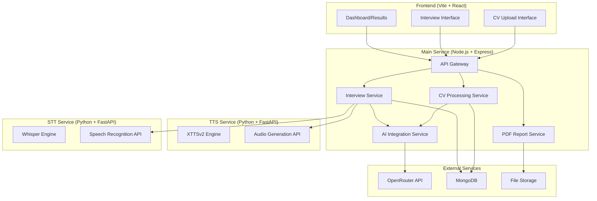
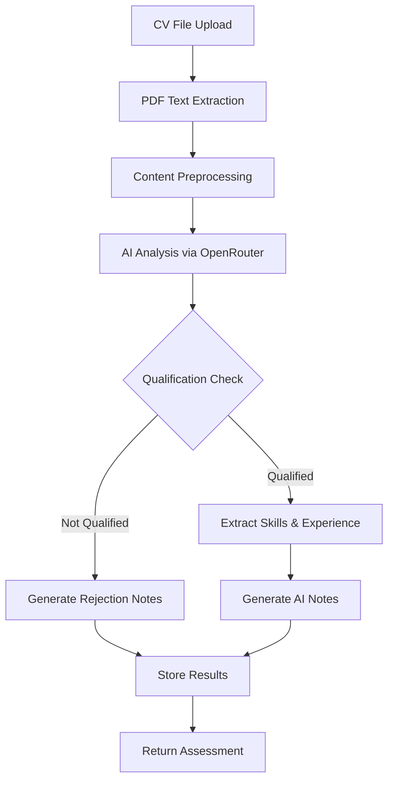
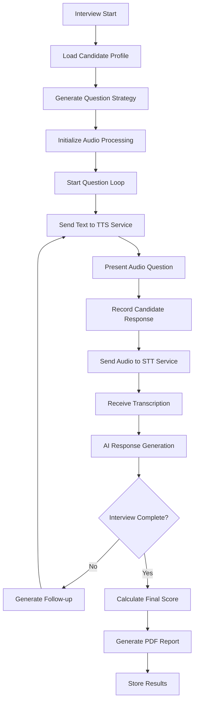
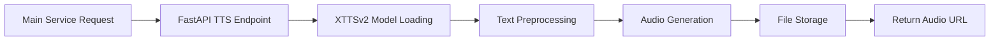
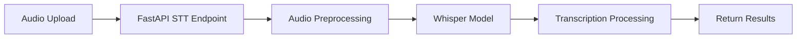
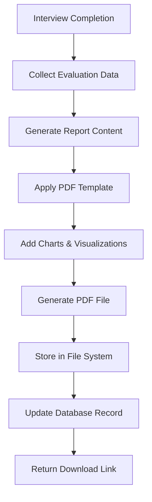

# AI CV Screening and Interview System

## Overview

An intelligent recruitment platform that automates CV screening and conducts AI-powered interviews using natural language processing, speech-to-text, and text-to-speech technologies. The system evaluates candidate qualifications, extracts relevant experience and skills, and conducts interactive interviews to assess both technical competencies and soft skills.

### Core Features
- **AI-Powered CV Analysis**: Automated parsing and qualification assessment using OpenRouter AI models
- **Interactive AI Interviews**: Real-time conversational interviews with TTS/STT capabilities  
- **Skills Verification**: Confirmation of technical and soft skills through dynamic questioning
- **Audio Processing**: XTTSv2 for speech synthesis and OpenAI Whisper for speech recognition
- **Qualification Scoring**: Structured evaluation and notes generation
- **PDF Report Generation**: Automated interview result reports with detailed candidate assessment

## Technology Stack & Dependencies

### Main Service (Node.js)
- **Runtime**: Node.js with Express.js framework
- **AI Integration**: OpenRouter API for LLM access
- **File Processing**: PDF parsing libraries (pdf-parse, pdfjs-dist)
- **PDF Generation**: Puppeteer or jsPDF for interview report creation
- **Real-time Communication**: Socket.io for interview sessions
- **Database**: MongoDB for candidate data and interview records

### TTS Service (Python/FastAPI)
- **Framework**: FastAPI with Uvicorn server
- **TTS Engine**: XTTSv2 for speech synthesis
- **Audio Processing**: librosa, soundfile for audio manipulation
- **API Documentation**: Automatic OpenAPI/Swagger documentation

### STT Service (Python/FastAPI)
- **Framework**: FastAPI with Uvicorn server
- **STT Engine**: OpenAI Whisper for speech recognition
- **Audio Processing**: ffmpeg-python for audio format conversion
- **File Handling**: Temporary file management for audio processing

### Frontend (Vite/React)
- **Build Tool**: Vite for fast development and building
- **Framework**: React.js with TypeScript
- **UI Components**: Material-UI or Ant Design
- **Audio Handling**: Web Audio API, MediaRecorder API
- **Real-time**: Socket.io-client
- **File Upload**: react-dropzone for CV uploads
- **HTTP Client**: Axios for API communication

## Architecture

### Project Structure
```
hr-system/
├── frontend/                 # Vite + React application
│   ├── src/
│   ├── public/
│   ├── package.json
│   ├── vite.config.ts
│   └── ...
├── backend/                  # Node.js + Express main service
│   ├── src/
│   ├── uploads/
│   ├── reports/
│   ├── package.json
│   └── ...
├── tts-service/             # Python + FastAPI for XTTSv2
│   ├── app/
│   ├── models/
│   ├── requirements.txt
│   ├── main.py
│   └── ...
├── stt-service/             # Python + FastAPI for Whisper
│   ├── app/
│   ├── temp/
│   ├── requirements.txt
│   ├── main.py
│   └── ...
└── docker-compose.yml       # Optional containerization
```

### System Architecture


### Service Communication Flow
1. **Frontend**: Vite-built React app communicates with main service
2. **Main Service**: Orchestrates CV analysis, interviews, and report generation
3. **TTS Service**: Receives text from main service, returns generated audio
4. **STT Service**: Receives audio from main service, returns transcribed text
5. **External APIs**: OpenRouter for AI, MongoDB for persistence

## API Endpoints Reference

### CV Processing Endpoints

#### POST /api/cv/upload
Upload and analyze candidate CV
```typescript
Request: FormData {
  cv: File,
  jobDescription: string,
  jobTitle: string
}

Response: {
  candidateId: string,
  qualified: boolean,
  qualificationScore: number,
  extractedSkills: string[],
  experience: {
    years: number,
    relevantRoles: string[],
    technologies: string[]
  },
  aiNotes: string,
  nextStep: "interview" | "rejected"
}
```

#### GET /api/cv/analysis/:candidateId
Retrieve CV analysis results
```typescript
Response: {
  candidateId: string,
  analysisResults: CVAnalysis,
  timestamp: Date
}
```

### Interview Management Endpoints

#### POST /api/interview/start
Initialize interview session
```typescript
Request: {
  candidateId: string,
  interviewType: "technical" | "behavioral" | "mixed"
}

Response: {
  sessionId: string,
  interviewQuestions: string[],
  estimatedDuration: number
}
```

#### POST /api/interview/audio/process
Process audio input during interview (communicates with STT service)
```typescript
Request: FormData {
  audio: Blob,
  sessionId: string,
  questionId: string
}

Response: {
  transcription: string,
  confidence: number,
  aiResponse: string,
  audioResponseUrl: string, // URL to generated TTS audio
  nextQuestion?: string
}
```

#### GET /api/interview/results/:sessionId
Get interview evaluation
```typescript
Response: {
  sessionId: string,
  overallScore: number,
  skillsAssessment: {
    technical: SkillScore[],
    soft: SkillScore[],
    communication: number
  },
  recommendations: string,
  transcript: InterviewMessage[]
}
```

#### GET /api/interview/report/:sessionId
Generate and download PDF interview report
```typescript
Response: {
  reportUrl: string,
  fileName: string,
  generatedAt: Date
}

// Direct PDF download
// Content-Type: application/pdf
// Content-Disposition: attachment; filename="interview-report-{candidateId}.pdf"
```

### Authentication Requirements
- API key authentication for OpenRouter integration
- Session-based authentication for interview continuity
- CORS configuration for cross-origin requests
- Service-to-service authentication between main service and TTS/STT services

## TTS Service API (Python/FastAPI)

### Text-to-Speech Endpoints

#### POST /generate-speech
Generate audio from text using XTTSv2
```python
Request: {
    "text": str,
    "voice_settings": {
        "speaker": str,  # Voice model identifier
        "speed": float,  # Speech rate (0.5-2.0)
        "emotion": str   # "neutral", "professional", "friendly"
    },
    "audio_format": str  # "wav", "mp3"
}

Response: {
    "audio_url": str,    # URL to generated audio file
    "duration": float,   # Audio duration in seconds
    "file_size": int,    # File size in bytes
    "status": "success" | "error",
    "message": str
}
```

#### GET /voices
List available voice models
```python
Response: {
    "voices": [
        {
            "id": str,
            "name": str,
            "language": str,
            "gender": "male" | "female",
            "description": str
        }
    ]
}
```

#### GET /health
Service health check
```python
Response: {
    "status": "healthy",
    "model_loaded": bool,
    "gpu_available": bool,
    "memory_usage": str
}
```

## STT Service API (Python/FastAPI)

### Speech-to-Text Endpoints

#### POST /transcribe
Transcribe audio using OpenAI Whisper
```python
Request: FormData {
    "audio": UploadFile,  # Audio file (wav, mp3, m4a, etc.)
    "language": str,      # Optional: "en", "auto"
    "model_size": str     # "tiny", "base", "small", "medium", "large"
}

Response: {
    "transcription": str,
    "confidence": float,  # 0.0-1.0
    "language": str,      # Detected language
    "duration": float,    # Audio duration
    "processing_time": float,
    "segments": [         # Word-level timestamps
        {
            "text": str,
            "start": float,
            "end": float,
            "confidence": float
        }
    ]
}
```

#### POST /transcribe-stream
Real-time audio transcription (WebSocket)
```python
# WebSocket endpoint for streaming audio
# Client sends audio chunks, server returns partial transcriptions
ws://stt-service:8002/transcribe-stream

# Message format:
{
    "audio_chunk": bytes,  # Base64 encoded audio data
    "is_final": bool,      # True for final chunk
    "session_id": str
}

# Response format:
{
    "partial_text": str,
    "is_final": bool,
    "confidence": float,
    "session_id": str
}
```

#### GET /models
List available Whisper models
```python
Response: {
    "models": [
        {
            "name": str,
            "size": str,
            "languages": [str],
            "accuracy": str,
            "speed": str
        }
    ]
}
```

#### GET /health
Service health check
```python
Response: {
    "status": "healthy",
    "model_loaded": bool,
    "gpu_available": bool,
    "supported_formats": [str]
}
```

## Data Models & ORM Mapping

### Candidate Model
```typescript
interface Candidate {
  _id: ObjectId;
  personalInfo: {
    name: string;
    email: string;
    phone?: string;
  };
  cvFile: {
    originalName: string;
    filePath: string;
    uploadDate: Date;
  };
  analysis: CVAnalysis;
  interviewSessions: ObjectId[];
  status: "pending" | "qualified" | "rejected" | "interviewed";
  createdAt: Date;
  updatedAt: Date;
}
```

### CV Analysis Model
```typescript
interface CVAnalysis {
  qualified: boolean;
  qualificationScore: number;
  extractedData: {
    skills: string[];
    experience: {
      totalYears: number;
      positions: WorkExperience[];
      education: Education[];
    };
    technologies: string[];
    certifications: string[];
  };
  aiNotes: string;
  matchingCriteria: {
    criterion: string;
    met: boolean;
    evidence: string;
  }[];
  processedAt: Date;
}
```

### Interview Session Model
```typescript
interface InterviewSession {
  _id: ObjectId;
  candidateId: ObjectId;
  sessionType: "technical" | "behavioral" | "mixed";
  status: "active" | "completed" | "terminated";
  transcript: InterviewMessage[];
  audioFiles: AudioFile[];
  evaluation: {
    overallScore: number;
    skillsVerified: SkillAssessment[];
    communicationScore: number;
    confidence: number;
  };
  pdfReport?: {
    filePath: string;
    generatedAt: Date;
    fileName: string;
  };
  startTime: Date;
  endTime?: Date;
  duration?: number;
}
```

### Interview Message Model
```typescript
interface InterviewMessage {
  speaker: "ai" | "candidate";
  content: string;
  audioFile?: string;
  timestamp: Date;
  questionCategory?: "technical" | "behavioral" | "clarification";
}
```

## Business Logic Layer

### CV Processing Service Architecture



#### CV Analysis Workflow
1. **File Processing**: Extract text from PDF using pdf-parse
2. **Content Structuring**: Clean and format extracted text
3. **AI Qualification Assessment**: Send structured prompt to OpenRouter
4. **Data Extraction**: Parse AI response for skills, experience, education
5. **Scoring Algorithm**: Calculate qualification score based on job requirements
6. **Notes Generation**: Create detailed assessment notes

### Interview Service Architecture



#### Interview Flow Logic
1. **Session Initialization**: Create interview context with candidate data
2. **Dynamic Questioning**: Generate questions based on CV analysis
3. **Audio Processing Pipeline**: Main Service → TTS Service → User Speech → STT Service → AI Analysis
4. **Skill Verification**: Cross-reference responses with CV claims
5. **Adaptive Questioning**: Adjust difficulty based on responses
6. **Real-time Evaluation**: Score responses and update assessment
7. **PDF Report Generation**: Create comprehensive evaluation document
8. **Service Communication**: Coordinate between main service and audio processing services

### AI Integration Service

#### OpenRouter Configuration
```typescript
interface OpenRouterConfig {
  apiKey: string;
  model: string; // e.g., "anthropic/claude-3-sonnet"
  baseURL: "https://openrouter.ai/api/v1";
  maxTokens: number;
  temperature: number;
}
```

#### Prompt Templates
1. **CV Analysis Prompt**: Structured prompt for qualification assessment
2. **Interview Questions**: Dynamic question generation based on role
3. **Response Evaluation**: Scoring candidate answers
4. **Follow-up Generation**: Creating contextual follow-up questions

## Audio Processing Service

### TTS Service Architecture (Python/FastAPI)


#### XTTSv2 Service Implementation
```python
# tts-service/app/main.py
from fastapi import FastAPI, HTTPException
from pydantic import BaseModel
import torch
from TTS.api import TTS
import os
import uuid

app = FastAPI(title="TTS Service", version="1.0.0")

# Initialize XTTSv2 model
tts_model = None

@app.on_event("startup")
async def load_model():
    global tts_model
    device = "cuda" if torch.cuda.is_available() else "cpu"
    tts_model = TTS("tts_models/multilingual/multi-dataset/xtts_v2").to(device)

class TTSRequest(BaseModel):
    text: str
    voice_settings: dict
    audio_format: str = "wav"

@app.post("/generate-speech")
async def generate_speech(request: TTSRequest):
    try:
        output_path = f"audio/{uuid.uuid4()}.{request.audio_format}"
        
        tts_model.tts_to_file(
            text=request.text,
            speaker_wav="path/to/speaker.wav",  # Reference voice
            language="en",
            file_path=output_path
        )
        
        return {
            "audio_url": f"/audio/{os.path.basename(output_path)}",
            "status": "success"
        }
    except Exception as e:
        raise HTTPException(status_code=500, detail=str(e))
```

### STT Service Architecture (Python/FastAPI)


#### Whisper Service Implementation
```python
# stt-service/app/main.py
from fastapi import FastAPI, UploadFile, File
import whisper
import tempfile
import os

app = FastAPI(title="STT Service", version="1.0.0")

# Initialize Whisper model
whisper_model = None

@app.on_event("startup")
async def load_model():
    global whisper_model
    whisper_model = whisper.load_model("base")

class STTRequest(BaseModel):
    language: str = "en"
    model_size: str = "base"

@app.post("/transcribe")
async def transcribe_audio(audio: UploadFile = File(...)):
    try:
        # Save uploaded file temporarily
        with tempfile.NamedTemporaryFile(delete=False, suffix=".wav") as tmp_file:
            content = await audio.read()
            tmp_file.write(content)
            tmp_file_path = tmp_file.name
        
        # Transcribe using Whisper
        result = whisper_model.transcribe(tmp_file_path)
        
        # Clean up temporary file
        os.unlink(tmp_file_path)
        
        return {
            "transcription": result["text"],
            "confidence": 0.95,  # Whisper doesn't provide confidence scores
            "language": result["language"],
            "segments": result["segments"]
        }
    except Exception as e:
        raise HTTPException(status_code=500, detail=str(e))
```

## PDF Report Generation Service

### Report Structure
The PDF interview report contains comprehensive candidate evaluation with the following sections:

#### Report Template Structure
```typescript
interface InterviewReport {
  header: {
    candidateName: string;
    position: string;
    interviewDate: Date;
    interviewer: "AI Interviewer";
    duration: string;
    reportId: string;
  };
  
  executiveSummary: {
    overallRecommendation: "Highly Recommended" | "Recommended" | "Not Recommended";
    overallScore: number; // 0-100
    keyStrengths: string[];
    areasOfConcern: string[];
    summaryNotes: string;
  };
  
  skillsAssessment: {
    technicalSkills: SkillEvaluation[];
    softSkills: SkillEvaluation[];
    communicationSkills: {
      clarity: number;
      confidence: number;
      articulation: number;
      listeningSkills: number;
    };
  };
  
  interviewAnalysis: {
    questionsAsked: number;
    responseQuality: number;
    consistencyScore: number;
    cvVerification: CVVerificationResult[];
  };
  
  detailedEvaluation: {
    questionCategories: QuestionCategoryResult[];
    transcriptSummary: string;
    behavioralIndicators: string[];
  };
  
  recommendations: {
    hiringDecision: string;
    nextSteps: string[];
    trainingNeeds: string[];
    additionalNotes: string;
  };
}
```

#### Skill Evaluation Model
```typescript
interface SkillEvaluation {
  skillName: string;
  claimedInCV: boolean;
  verifiedInInterview: boolean;
  proficiencyLevel: "Beginner" | "Intermediate" | "Advanced" | "Expert";
  score: number; // 0-10
  evidence: string;
  gaps: string[];
}
```

### PDF Generation Workflow



#### Report Generation Process
1. **Data Aggregation**: Compile interview results, CV analysis, and evaluation scores
2. **Content Generation**: Use AI to generate executive summary and recommendations
3. **Template Application**: Apply professional PDF template with company branding
4. **Visualization**: Add score charts, skill matrices, and progress indicators
5. **File Creation**: Generate PDF using Puppeteer with HTML/CSS template
6. **Storage**: Save to file system with secure access controls

### PDF Template Components

#### Visual Elements
- **Score Dashboard**: Circular progress indicators for overall and category scores
- **Skills Matrix**: Heat map visualization of technical and soft skills
- **Timeline**: Interview flow and response quality progression
- **Comparison Charts**: CV claims vs. interview verification

#### Report Sections Layout
```html
<!-- Page 1: Executive Summary -->
<section class="executive-summary">
  <div class="candidate-info">
    <h1>Interview Assessment Report</h1>
    <div class="candidate-details">...</div>
  </div>
  
  <div class="overall-score">
    <div class="score-circle">85%</div>
    <div class="recommendation">Recommended</div>
  </div>
  
  <div class="key-findings">
    <div class="strengths">...</div>
    <div class="concerns">...</div>
  </div>
</section>

<!-- Page 2: Skills Assessment -->
<section class="skills-assessment">
  <div class="technical-skills">
    <h2>Technical Skills Evaluation</h2>
    <table class="skills-table">...</table>
  </div>
  
  <div class="soft-skills">
    <h2>Soft Skills Assessment</h2>
    <div class="skills-radar-chart">...</div>
  </div>
</section>

<!-- Page 3: Detailed Analysis -->
<section class="detailed-analysis">
  <div class="interview-flow">
    <h2>Interview Analysis</h2>
    <div class="question-responses">...</div>
  </div>
  
  <div class="cv-verification">
    <h2>CV Claims Verification</h2>
    <table class="verification-table">...</table>
  </div>
</section>

<!-- Page 4: Recommendations -->
<section class="recommendations">
  <div class="hiring-decision">
    <h2>Hiring Recommendation</h2>
    <div class="decision-summary">...</div>
  </div>
  
  <div class="next-steps">
    <h2>Recommended Next Steps</h2>
    <ul class="action-items">...</ul>
  </div>
</section>
```

### PDF Styling Configuration
```css
@page {
  size: A4;
  margin: 20mm;
}

.report-header {
  border-bottom: 3px solid #2c3e50;
  padding-bottom: 20px;
  margin-bottom: 30px;
}

.score-circle {
  width: 120px;
  height: 120px;
  border-radius: 50%;
  background: conic-gradient(#27ae60 0deg calc(var(--score) * 3.6deg), #ecf0f1 0deg);
  display: flex;
  align-items: center;
  justify-content: center;
  font-size: 24px;
  font-weight: bold;
}

.skills-table {
  width: 100%;
  border-collapse: collapse;
  margin: 20px 0;
}

.skills-table th,
.skills-table td {
  padding: 12px;
  text-align: left;
  border-bottom: 1px solid #ddd;
}

.skill-score {
  display: inline-block;
  width: 20px;
  height: 20px;
  border-radius: 50%;
  color: white;
  text-align: center;
  font-size: 12px;
  line-height: 20px;
}

.score-excellent { background-color: #27ae60; }
.score-good { background-color: #f39c12; }
.score-poor { background-color: #e74c3c; }
```

## Real-time Communication Architecture

### WebSocket Events
```typescript
// Client to Server Events
interface ClientEvents {
  "join-interview": { sessionId: string };
  "audio-chunk": { audio: Blob, timestamp: number };
  "answer-complete": { questionId: string };
  "request-clarification": { context: string };
}

// Server to Client Events  
interface ServerEvents {
  "question-ready": { question: string, audioUrl: string };
  "transcription-update": { text: string, confidence: number };
  "ai-response": { response: string, audioUrl: string };
  "interview-complete": { results: InterviewResults };
  "error": { message: string, code: string };
}
```

### Connection Management
- Session persistence during network interruptions
- Audio buffer management for smooth communication
- Timeout handling for candidate responses
- Graceful error recovery mechanisms

## Testing Strategy

### Unit Testing Framework
- **Main Service (Node.js)**: Jest with Supertest for API testing
- **TTS Service (Python)**: pytest with FastAPI TestClient
- **STT Service (Python)**: pytest with mock audio files
- **Frontend (Vite/React)**: Vitest with React Testing Library

### Integration Testing
- **CV Processing Pipeline**: End-to-end CV analysis workflow
- **Interview Session Flow**: Complete interview simulation
- **Service Communication**: Testing API calls between services
- **Audio Processing**: TTS/STT service integration validation
- **PDF Generation**: Report creation and download functionality

### Service-Specific Testing

#### TTS Service Testing
```python
# tts-service/tests/test_tts.py
import pytest
from fastapi.testclient import TestClient
from app.main import app

client = TestClient(app)

def test_generate_speech():
    response = client.post("/generate-speech", json={
        "text": "Hello, this is a test.",
        "voice_settings": {"speaker": "default", "speed": 1.0},
        "audio_format": "wav"
    })
    assert response.status_code == 200
    assert "audio_url" in response.json()
```

#### STT Service Testing
```python
# stt-service/tests/test_stt.py
import pytest
from fastapi.testclient import TestClient
from app.main import app

client = TestClient(app)

def test_transcribe_audio():
    with open("test_audio.wav", "rb") as audio_file:
        response = client.post("/transcribe", 
            files={"audio": ("test.wav", audio_file, "audio/wav")})
    assert response.status_code == 200
    assert "transcription" in response.json()
```

### Test Data Management
- Sample CV files for various qualification levels
- Mock audio files for STT testing
- Predefined AI responses for consistent testing
- Template PDF reports for layout validation
- Service mock responses for integration testing

### Performance Testing
- Audio latency measurement
- Concurrent interview session handling
- AI response time optimization
- File upload and processing speed

## Configuration Management

### Main Service Environment Variables (.env)
```bash
# AI Configuration
OPENROUTER_API_KEY=your_openrouter_key
OPENROUTER_MODEL=anthropic/claude-3-sonnet
AI_TEMPERATURE=0.7
AI_MAX_TOKENS=2000

# Service URLs
TTS_SERVICE_URL=http://localhost:8001
STT_SERVICE_URL=http://localhost:8002

# Application Settings
NODE_ENV=development
PORT=3000
MONGODB_URI=mongodb://localhost:27017/hr-system
SESSION_SECRET=your_session_secret

# File Storage
UPLOAD_PATH=./uploads
REPORT_PATH=./reports
MAX_FILE_SIZE=10MB
ALLOWED_FILE_TYPES=pdf

# Interview Settings
MAX_INTERVIEW_DURATION=45
QUESTIONS_PER_INTERVIEW=10
RESPONSE_TIMEOUT=300
```

### TTS Service Configuration
```bash
# tts-service/.env
SERVICE_PORT=8001
MODEL_PATH=./models/xtts_v2
AUDIO_OUTPUT_PATH=./audio
MAX_TEXT_LENGTH=500
DEFAULT_VOICE=professional
GPU_ENABLED=true
```

### STT Service Configuration
```bash
# stt-service/.env
SERVICE_PORT=8002
WHISPER_MODEL=base
TEMP_AUDIO_PATH=./temp
MAX_AUDIO_SIZE=25MB
SUPPORTED_FORMATS=wav,mp3,m4a,flac
GPU_ENABLED=true
```

### Frontend Configuration (Vite)
```typescript
// frontend/vite.config.ts
import { defineConfig } from 'vite'
import react from '@vitejs/plugin-react'

export default defineConfig({
  plugins: [react()],
  server: {
    port: 5173,
    proxy: {
      '/api': {
        target: 'http://localhost:3000',
        changeOrigin: true
      }
    }
  },
  build: {
    outDir: 'dist',
    sourcemap: true
  },
  env: {
    VITE_API_BASE_URL: 'http://localhost:3000/api',
    VITE_WS_URL: 'ws://localhost:3000'
  }
})
```

### Service Deployment Configuration
```yaml
# docker-compose.yml (Optional)
version: '3.8'
services:
  frontend:
    build: ./frontend
    ports:
      - "5173:5173"
    depends_on:
      - backend
  
  backend:
    build: ./backend
    ports:
      - "3000:3000"
    environment:
      - TTS_SERVICE_URL=http://tts-service:8001
      - STT_SERVICE_URL=http://stt-service:8002
    depends_on:
      - mongodb
      - tts-service
      - stt-service
  
  tts-service:
    build: ./tts-service
    ports:
      - "8001:8001"
    volumes:
      - ./tts-service/models:/app/models
      - ./tts-service/audio:/app/audio
  
  stt-service:
    build: ./stt-service
    ports:
      - "8002:8002"
    volumes:
      - ./stt-service/temp:/app/temp
  
  mongodb:
    image: mongo:latest
    ports:
      - "27017:27017"
    volumes:
      - mongodb_data:/data/db

volumes:
  mongodb_data:
```