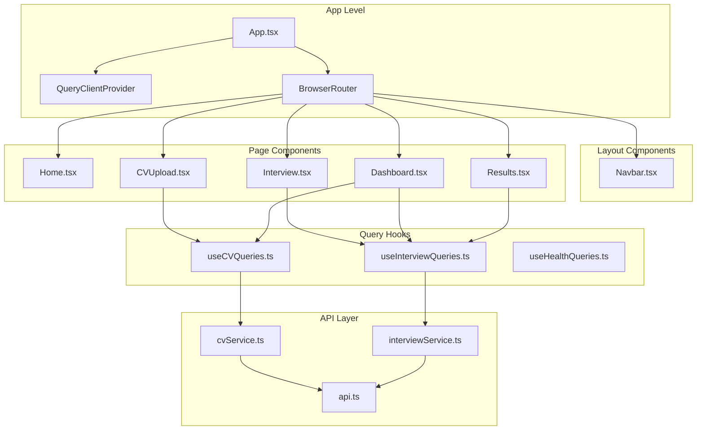
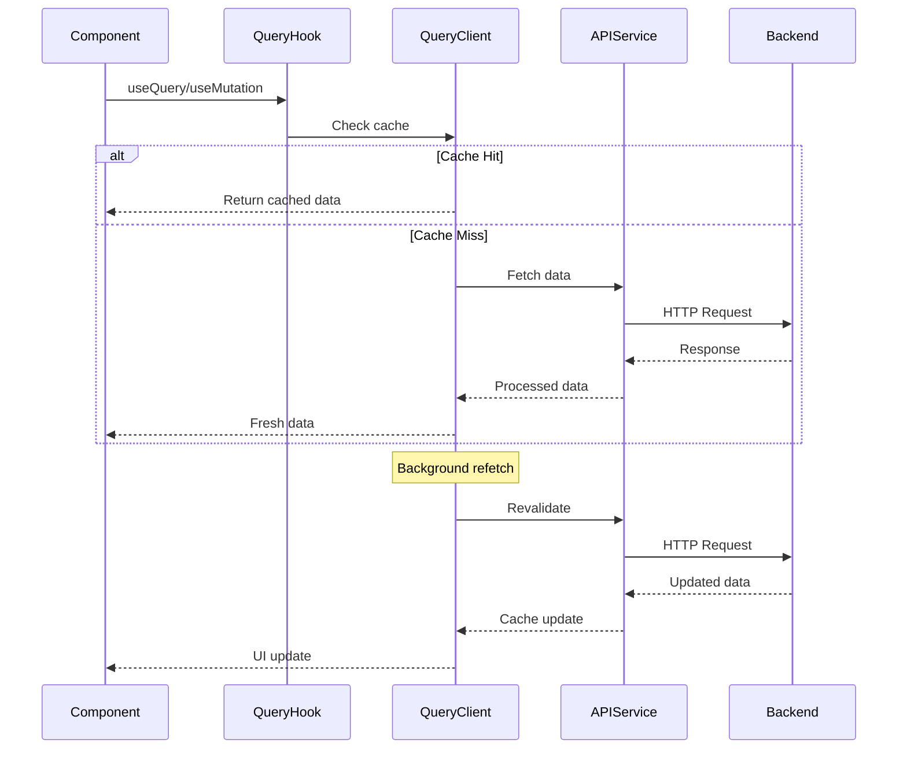

# React Query and Tailwind CSS Integration Design

## Overview

This design outlines the integration of React Query (TanStack Query) for data fetching and Tailwind CSS for styling into the existing HR AI Recruitment Platform frontend. The migration will replace the current Axios-based API calls with React Query's powerful caching and state management capabilities, while transitioning from Material-UI to Tailwind CSS for a more customizable and performance-optimized styling approach.

## Technology Stack Updates

### Current Stack
- **UI Framework**: React 19.1.1 with TypeScript
- **Styling**: Material-UI (MUI) 7.3.1
- **Data Fetching**: Axios 1.11.0 with custom service classes
- **State Management**: React hooks (useState, useEffect)
- **Routing**: React Router DOM 7.8.2

### Target Stack
- **UI Framework**: React 19.1.1 with TypeScript (unchanged)
- **Styling**: Tailwind CSS 3.x
- **Data Fetching**: React Query (TanStack Query) 5.x
- **State Management**: React Query + React hooks
- **Routing**: React Router DOM 7.8.2 (unchanged)

## Component Architecture

### Updated Component Hierarchy



### Provider Setup

#### Query Client Configuration
```typescript
// queryClient.ts
import { QueryClient } from '@tanstack/react-query'

export const queryClient = new QueryClient({
  defaultOptions: {
    queries: {
      staleTime: 5 * 60 * 1000, // 5 minutes
      gcTime: 10 * 60 * 1000,   // 10 minutes
      retry: 3,
      refetchOnWindowFocus: false,
    },
    mutations: {
      retry: 1,
    },
  },
})
```

#### App Component Updates
- Replace ThemeProvider with QueryClientProvider
- Integrate Tailwind CSS classes
- Remove Material-UI dependencies

## Data Fetching Architecture

### React Query Integration Pattern



### Query Hooks Architecture

#### CV Management Queries
```typescript
// hooks/useCVQueries.ts
export const useCVQueries = () => {
  // Upload CV mutation
  const uploadCV = useMutation({
    mutationFn: CVService.uploadCV,
    onSuccess: () => {
      queryClient.invalidateQueries({ queryKey: ['candidates'] })
    }
  })
  
  // Get candidates list
  const candidates = useQuery({
    queryKey: ['candidates', filters],
    queryFn: () => CVService.getCandidates(filters)
  })
  
  // Get CV analysis
  const analysis = useQuery({
    queryKey: ['cv-analysis', candidateId],
    queryFn: () => CVService.getAnalysis(candidateId),
    enabled: !!candidateId
  })
  
  return { uploadCV, candidates, analysis }
}
```

#### Interview Management Queries
```typescript
// hooks/useInterviewQueries.ts
export const useInterviewQueries = () => {
  // Start interview mutation
  const startInterview = useMutation({
    mutationFn: InterviewService.startInterview,
    onSuccess: (data) => {
      queryClient.setQueryData(['interview', data.sessionId], data)
    }
  })
  
  // Process audio mutation
  const processAudio = useMutation({
    mutationFn: InterviewService.processAudio,
    onSuccess: (_, variables) => {
      queryClient.invalidateQueries({ 
        queryKey: ['interview', variables.sessionId] 
      })
    }
  })
  
  // Get interview session
  const session = useQuery({
    queryKey: ['interview', sessionId],
    queryFn: () => InterviewService.getResults(sessionId),
    enabled: !!sessionId,
    refetchInterval: (data) => data?.status === 'active' ? 5000 : false
  })
  
  return { startInterview, processAudio, session }
}
```

### Query Key Patterns

```typescript
// queryKeys.ts
export const queryKeys = {
  // CV related queries
  candidates: (filters?: CandidateFilters) => ['candidates', filters],
  candidate: (id: string) => ['candidate', id],
  cvAnalysis: (candidateId: string) => ['cv-analysis', candidateId],
  cvReport: (candidateId: string) => ['cv-report', candidateId],
  
  // Interview related queries
  interviews: (filters?: InterviewFilters) => ['interviews', filters],
  interview: (sessionId: string) => ['interview', sessionId],
  interviewReport: (sessionId: string) => ['interview-report', sessionId],
  
  // Health checks
  health: () => ['health'],
  detailedHealth: () => ['health', 'detailed'],
} as const
```

## Styling Strategy

### Tailwind CSS Integration

#### Configuration Setup
```javascript
// tailwind.config.js
module.exports = {
  content: [
    "./index.html",
    "./src/**/*.{js,ts,jsx,tsx}",
  ],
  theme: {
    extend: {
      colors: {
        primary: {
          50: '#eff6ff',
          500: '#667eea',
          600: '#5a67d8',
          700: '#4c51bf',
        },
        secondary: {
          500: '#764ba2',
          600: '#6b46c1',
        }
      },
      fontFamily: {
        sans: ['Inter', 'system-ui', 'sans-serif'],
      },
      spacing: {
        '18': '4.5rem',
        '88': '22rem',
      }
    },
  },
  plugins: [
    require('@tailwindcss/forms'),
    require('@tailwindcss/typography'),
  ],
}
```

#### Component Migration Pattern

##### Before (Material-UI)
```typescript
<Box sx={{ 
  display: 'flex', 
  flexDirection: 'column', 
  minHeight: '100vh' 
}}>
  <Typography variant="h4" color="primary">
    Upload CV
  </Typography>
  <Button variant="contained" color="primary">
    Submit
  </Button>
</Box>
```

##### After (Tailwind CSS)
```typescript
<div className="flex flex-col min-h-screen">
  <h1 className="text-2xl font-semibold text-primary-500">
    Upload CV
  </h1>
  <button className="bg-primary-500 hover:bg-primary-600 text-white font-medium py-2 px-4 rounded-lg transition-colors">
    Submit
  </button>
</div>
```

### Design System Components

#### Button Component
```typescript
// components/ui/Button.tsx
interface ButtonProps {
  variant?: 'primary' | 'secondary' | 'outline'
  size?: 'sm' | 'md' | 'lg'
  children: React.ReactNode
  onClick?: () => void
  disabled?: boolean
}

const buttonVariants = {
  primary: 'bg-primary-500 hover:bg-primary-600 text-white',
  secondary: 'bg-secondary-500 hover:bg-secondary-600 text-white',
  outline: 'border border-primary-500 text-primary-500 hover:bg-primary-50'
}

const buttonSizes = {
  sm: 'px-3 py-1.5 text-sm',
  md: 'px-4 py-2 text-base',
  lg: 'px-6 py-3 text-lg'
}
```

#### Card Component
```typescript
// components/ui/Card.tsx
interface CardProps {
  children: React.ReactNode
  className?: string
  padding?: 'sm' | 'md' | 'lg'
}

export const Card = ({ children, className = '', padding = 'md' }) => {
  const paddingClasses = {
    sm: 'p-4',
    md: 'p-6',
    lg: 'p-8'
  }
  
  return (
    <div className={`bg-white rounded-lg shadow-sm border border-gray-200 ${paddingClasses[padding]} ${className}`}>
      {children}
    </div>
  )
}
```

## Page Component Updates

### CVUpload Page Migration

#### Data Fetching with React Query
```typescript
// pages/CVUpload.tsx
export const CVUpload = () => {
  const { uploadCV } = useCVQueries()
  const [formData, setFormData] = useState<CVUploadRequest>()
  
  const handleSubmit = () => {
    uploadCV.mutate(formData, {
      onSuccess: (data) => {
        navigate(`/results/${data.candidateId}`)
      },
      onError: (error) => {
        toast.error(error.message)
      }
    })
  }
  
  return (
    <div className="max-w-4xl mx-auto p-6">
      <Card>
        <h1 className="text-2xl font-bold mb-6">Upload CV</h1>
        
        {uploadCV.isPending && (
          <div className="flex items-center gap-2 mb-4">
            <Spinner />
            <span>Analyzing CV...</span>
          </div>
        )}
        
        <form onSubmit={handleSubmit} className="space-y-6">
          {/* Form fields with Tailwind styling */}
        </form>
      </Card>
    </div>
  )
}
```

### Dashboard Page Migration

#### Multi-Query Management
```typescript
// pages/Dashboard.tsx
export const Dashboard = () => {
  const [filters, setFilters] = useState<CandidateFilters>({})
  const { candidates } = useCVQueries()
  const { interviews } = useInterviewQueries()
  
  return (
    <div className="max-w-7xl mx-auto p-6 space-y-8">
      <div className="grid grid-cols-1 md:grid-cols-2 lg:grid-cols-4 gap-6">
        <MetricCard 
          title="Total Candidates" 
          value={candidates.data?.total || 0}
          loading={candidates.isLoading}
        />
        <MetricCard 
          title="Active Interviews" 
          value={interviews.data?.active || 0}
          loading={interviews.isLoading}
        />
      </div>
      
      <div className="grid grid-cols-1 lg:grid-cols-2 gap-8">
        <Card>
          <h2 className="text-xl font-semibold mb-4">Recent Candidates</h2>
          <CandidateTable 
            data={candidates.data?.items || []}
            loading={candidates.isLoading}
          />
        </Card>
        
        <Card>
          <h2 className="text-xl font-semibold mb-4">Interview Sessions</h2>
          <InterviewTable 
            data={interviews.data?.items || []}
            loading={interviews.isLoading}
          />
        </Card>
      </div>
    </div>
  )
}
```

## Error Handling Strategy

### React Query Error Boundaries
```typescript
// components/ErrorBoundary.tsx
export const QueryErrorBoundary = ({ children }: { children: React.ReactNode }) => {
  return (
    <ErrorBoundary
      fallback={
        <div className="flex flex-col items-center justify-center min-h-96 p-8">
          <div className="text-red-500 text-6xl mb-4">⚠️</div>
          <h2 className="text-xl font-semibold text-gray-900 mb-2">Something went wrong</h2>
          <p className="text-gray-600 text-center mb-4">
            We encountered an error while loading this page. Please try refreshing.
          </p>
          <Button onClick={() => window.location.reload()}>
            Refresh Page
          </Button>
        </div>
      }
    >
      {children}
    </ErrorBoundary>
  )
}
```

### Query Error Handling
```typescript
// hooks/useErrorHandler.ts
export const useErrorHandler = () => {
  const toast = useToast()
  
  const handleError = (error: Error) => {
    console.error('Query error:', error)
    toast.error(error.message || 'An unexpected error occurred')
  }
  
  return { handleError }
}
```

## Loading States and Optimistic Updates

### Loading State Components
```typescript
// components/ui/LoadingStates.tsx
export const TableSkeleton = () => (
  <div className="space-y-3">
    {[...Array(5)].map((_, i) => (
      <div key={i} className="flex space-x-4 animate-pulse">
        <div className="h-4 bg-gray-300 rounded w-1/4"></div>
        <div className="h-4 bg-gray-300 rounded w-1/2"></div>
        <div className="h-4 bg-gray-300 rounded w-1/4"></div>
      </div>
    ))}
  </div>
)

export const CardSkeleton = () => (
  <Card>
    <div className="animate-pulse">
      <div className="h-6 bg-gray-300 rounded w-3/4 mb-4"></div>
      <div className="space-y-3">
        <div className="h-4 bg-gray-300 rounded"></div>
        <div className="h-4 bg-gray-300 rounded w-5/6"></div>
      </div>
    </div>
  </Card>
)
```

### Optimistic Updates
```typescript
// hooks/useCVMutations.ts
export const useCVMutations = () => {
  const queryClient = useQueryClient()
  
  const updateCandidateStatus = useMutation({
    mutationFn: ({ candidateId, status }: { candidateId: string, status: string }) =>
      CVService.updateCandidateStatus(candidateId, status),
    
    onMutate: async ({ candidateId, status }) => {
      // Cancel outgoing refetches
      await queryClient.cancelQueries({ queryKey: ['candidates'] })
      
      // Snapshot previous value
      const previousCandidates = queryClient.getQueryData(['candidates'])
      
      // Optimistically update
      queryClient.setQueryData(['candidates'], (old: any) => ({
        ...old,
        items: old.items.map((candidate: any) =>
          candidate._id === candidateId 
            ? { ...candidate, status }
            : candidate
        )
      }))
      
      return { previousCandidates }
    },
    
    onError: (err, variables, context) => {
      // Rollback on error
      queryClient.setQueryData(['candidates'], context?.previousCandidates)
    },
    
    onSettled: () => {
      // Always refetch after error or success
      queryClient.invalidateQueries({ queryKey: ['candidates'] })
    }
  })
  
  return { updateCandidateStatus }
}
```

## Performance Optimizations

### Query Optimization Strategies

#### Pagination and Infinite Queries
```typescript
// hooks/useInfiniteCandidates.ts
export const useInfiniteCandidates = (filters: CandidateFilters) => {
  return useInfiniteQuery({
    queryKey: ['candidates', 'infinite', filters],
    queryFn: ({ pageParam = 1 }) => 
      CVService.getCandidates({ ...filters, page: pageParam }),
    initialPageParam: 1,
    getNextPageParam: (lastPage, allPages) => 
      lastPage.hasMore ? allPages.length + 1 : undefined,
    staleTime: 5 * 60 * 1000,
  })
}
```

#### Prefetching Critical Data
```typescript
// hooks/usePrefetch.ts
export const usePrefetchDashboard = () => {
  const queryClient = useQueryClient()
  
  useEffect(() => {
    // Prefetch candidates on dashboard mount
    queryClient.prefetchQuery({
      queryKey: ['candidates', {}],
      queryFn: () => CVService.getCandidates({}),
      staleTime: 2 * 60 * 1000,
    })
    
    // Prefetch recent interviews
    queryClient.prefetchQuery({
      queryKey: ['interviews', { recent: true }],
      queryFn: () => InterviewService.getSessions({ recent: true }),
      staleTime: 2 * 60 * 1000,
    })
  }, [queryClient])
}
```

### Bundle Size Optimization

#### Selective Imports
```typescript
// Import only needed Tailwind utilities
import './styles/components.css' // Custom component styles
import './styles/utilities.css'  // Essential utilities only
```

#### Code Splitting
```typescript
// Lazy load heavy components
const Dashboard = lazy(() => import('./pages/Dashboard'))
const Interview = lazy(() => import('./pages/Interview'))

// Wrap with Suspense
<Suspense fallback={<PageSkeleton />}>
  <Routes>
    <Route path="/dashboard" element={<Dashboard />} />
    <Route path="/interview/:sessionId" element={<Interview />} />
  </Routes>
</Suspense>
```

## Testing Strategy

### Query Testing with MSW
```typescript
// tests/mocks/handlers.ts
export const handlers = [
  rest.get('/api/cv/candidates', (req, res, ctx) => {
    return res(
      ctx.json({
        items: mockCandidates,
        total: 10,
        page: 1,
        hasMore: false
      })
    )
  }),
  
  rest.post('/api/cv/upload', (req, res, ctx) => {
    return res(ctx.json({ candidateId: 'test-id', status: 'processed' }))
  })
]
```

### Component Testing
```typescript
// tests/components/CVUpload.test.tsx
describe('CVUpload', () => {
  test('uploads CV successfully', async () => {
    render(
      <QueryClient>
        <CVUpload />
      </QueryClient>
    )
    
    const fileInput = screen.getByLabelText(/upload cv/i)
    const submitButton = screen.getByRole('button', { name: /submit/i })
    
    fireEvent.change(fileInput, { target: { files: [testFile] } })
    fireEvent.click(submitButton)
    
    await waitFor(() => {
      expect(screen.getByText(/cv uploaded successfully/i)).toBeInTheDocument()
    })
  })
  
  test('shows loading state during upload', async () => {
    render(<CVUpload />)
    
    // Trigger upload
    fireEvent.click(screen.getByRole('button', { name: /submit/i }))
    
    expect(screen.getByText(/analyzing cv/i)).toBeInTheDocument()
  })
})
```

## Migration Implementation Plan

### Phase 1: Foundation Setup
1. Install React Query and Tailwind CSS dependencies
2. Configure QueryClient and TailwindCSS
3. Update App.tsx with providers
4. Create base UI components (Button, Card, Input)

### Phase 2: Query Hooks Implementation
1. Create query hooks for CV operations
2. Create query hooks for Interview operations
3. Implement error handling utilities
4. Add loading state components

### Phase 3: Component Migration
1. Migrate CVUpload page
2. Migrate Dashboard page
3. Migrate Interview page
4. Migrate Results page
5. Update Navbar component

### Phase 4: Optimization and Testing
1. Implement performance optimizations
2. Add comprehensive tests
3. Remove Material-UI dependencies
4. Final cleanup and documentation

## Package Dependencies

### Additions
```json
{
  "dependencies": {
    "@tanstack/react-query": "^5.0.0",
    "@tanstack/react-query-devtools": "^5.0.0",
    "tailwindcss": "^3.4.0",
    "@tailwindcss/forms": "^0.5.0",
    "@tailwindcss/typography": "^0.5.0",
    "autoprefixer": "^10.4.0",
    "postcss": "^8.4.0",
    "react-hot-toast": "^2.4.0"
  }
}
```

### Removals
```json
{
  "dependencies": {
    "@emotion/react": "^11.14.0",     // Remove
    "@emotion/styled": "^11.14.1",   // Remove
    "@mui/icons-material": "^7.3.1", // Remove
    "@mui/material": "^7.3.1",       // Remove
    "@mui/x-data-grid": "^8.11.0"    // Remove
  }
}
```